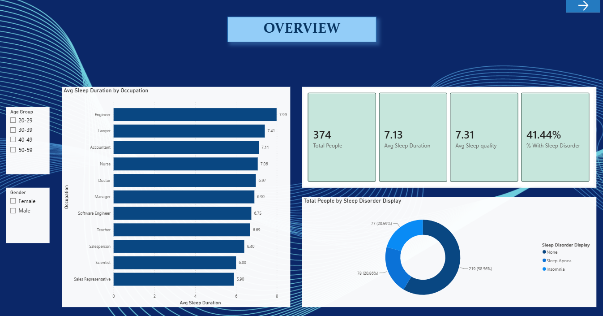
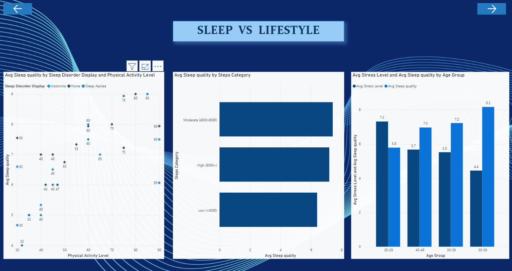
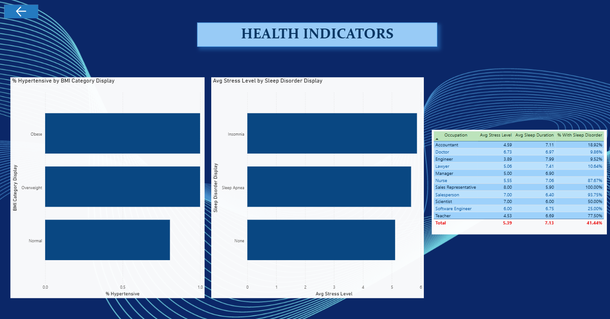

# Sleep Health & Lifestyle Analysis — Power BI Project

An interactive Power BI dashboard analyzing the relationship between lifestyle factors (physical activity, stress, occupation) and sleep health outcomes, built on the **Sleep Health and Lifestyle Dataset**.

---

## 📌 Project Overview

Sleep is often overlooked compared to diet and exercise, yet poor sleep is linked to serious health risks — including sleep disorders like Insomnia and Sleep Apnea, and cardiovascular issues like high blood pressure. This project analyzes sleep, lifestyle, and health data for **374 individuals** across **11 occupations** to uncover what actually drives good or bad sleep, and presents the findings through an interactive Power BI dashboard.

## 🎯 Objective

To analyze the relationship between lifestyle factors — physical activity, stress, and occupation — and sleep health outcomes, and to build an interactive Power BI dashboard highlighting key patterns in sleep quality, sleep disorders, and cardiovascular health across the surveyed population.

## 📊 Dataset

**Source:** [Sleep Health and Lifestyle Dataset — Kaggle](https://www.kaggle.com/datasets/uom190346a/sleep-health-and-lifestyle-dataset)

The raw dataset was organized into three logical tables inside Power BI:

| Table | Columns | Role |
|---|---|---|
| **Sleep Performance Metrix** | Person ID, Gender, Age, Occupation, Sleep Duration, Quality of Sleep, Sleep Disorder | Sleep outcomes |
| **Daily Lifestyle & Behaviors** | Physical Activity Level, Daily Steps, Stress Level | Lifestyle habits |
| **Cardiovascular & Physical Health** | BMI Category, Systolic BP, Diastolic BP, Heart Rate | Health consequences |

## 🛠️ Tools & Techniques

- **Microsoft Power BI Desktop** — data modeling, DAX, dashboard design
- **Power Query** — splitting Blood Pressure into Systolic/Diastolic, labeling blank Sleep Disorder values, grouping Age and Daily Steps
- **DAX Measures** — 6 core measures powering the dashboard:
  - `Total People`, `Avg Sleep Duration`, `Avg Sleep Quality`, `Avg Stress Level`
  - `% With Sleep Disorder`, `% Hypertensive`

## 📈 Dashboard

The dashboard has 3 pages:

1. **Overview** — KPI cards, sleep duration by occupation, sleep disorder breakdown
2. **Sleep vs. Lifestyle** — activity vs. sleep quality, steps category, stress & sleep quality by age group
3. **Health Indicators** — hypertension by BMI, stress by sleep disorder, occupation summary table

### 🖼️ Screenshots

> Dashboard screenshots are saved in the [`/Screenshots`](./Screenshot) folder of this repository.

| Overview | Sleep vs. Lifestyle | Health Indicators |
|---|---|---|
|  |  |  |

*(Rename the files in `/Screenshots` to match the names above, or update the paths in this README to match your actual filenames.)*

## 🔍 Key Insights

- **41.4%** of respondents report a sleep disorder — split almost evenly between Sleep Apnea (20.9%) and Insomnia (20.6%)
- **Stress is the strongest predictor of poor sleep** — a **-0.90 correlation** with sleep quality, the strongest relationship found in the dataset
- Sleep duration varies significantly by occupation — a **2.1-hour gap** between Engineers (7.99 hrs) and Sales Representatives (5.90 hrs)
- **88.8%** of respondents fall into the hypertensive blood pressure range, rising to **100%** for Overweight and Obese individuals

## ✅ Conclusion

Lifestyle factors — particularly stress and weight — have a measurable, significant impact on sleep quality and cardiovascular health. The findings suggest that workplace wellness efforts aimed at reducing stress and supporting healthy weight could meaningfully improve sleep health outcomes.

## 🚀 Future Scope

- Track participants over extended timeframes to study long-term trends
- Build machine learning models to predict Insomnia/Sleep Apnea risk from daily habits
- Create automated Power BI alerts for high-stress, low-activity occupational profiles

## 📁 Repository Structure

```
├── Sleep_health_and_lifestyle_dataset.csv   # Raw dataset
├── Sleep_Health_Dashboard.pbix              # Power BI project file
├── Screenshots/                             # Dashboard screenshots
│   ├── dashboard_overview.png
│   ├── dashboard_sleep_vs_lifestyle.png
│   └── dashboard_health_indicators.png
└── README.md
```

## 📚 References

- **Dataset:** [Kaggle — Sleep Health and Lifestyle Dataset](https://www.kaggle.com/datasets/uom190346a/sleep-health-and-lifestyle-dataset)
- **Visualization:** Microsoft Power BI

## 👤 Author

**Keerthana PV**

---

⭐ If you found this project useful, feel free to star the repo!
